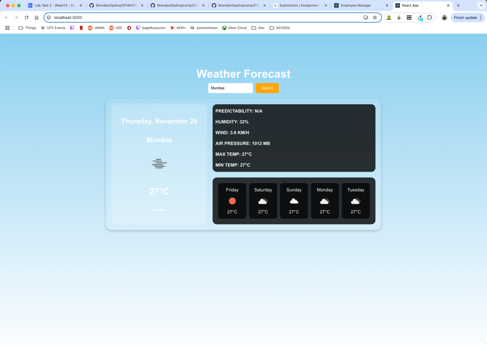
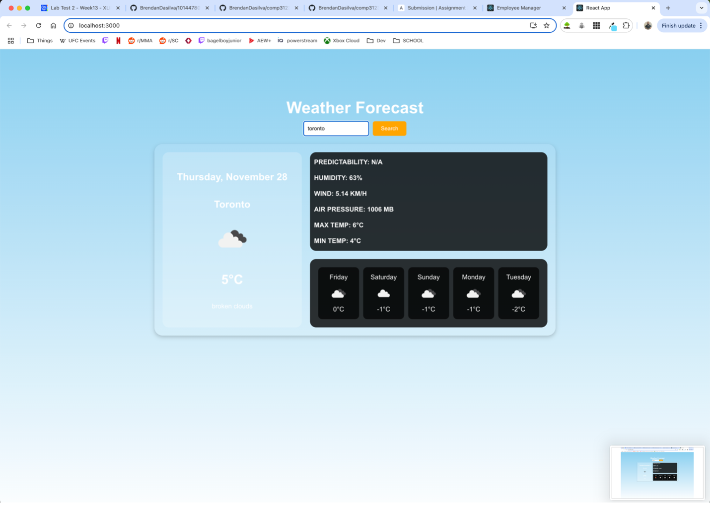
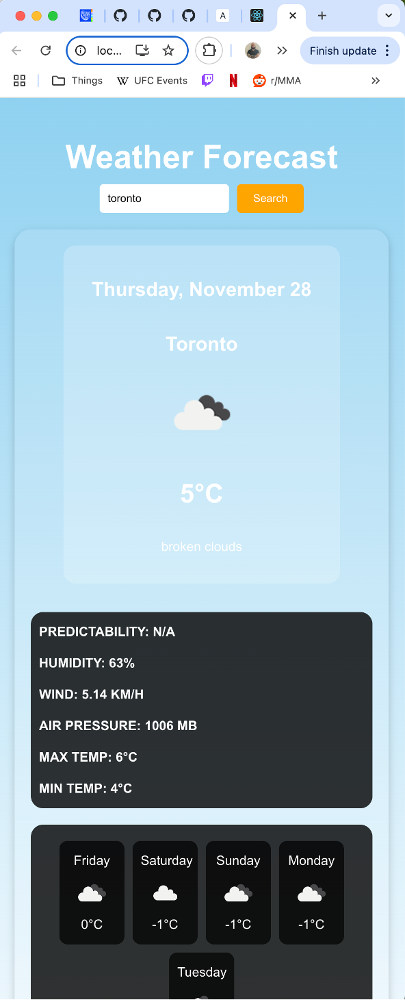
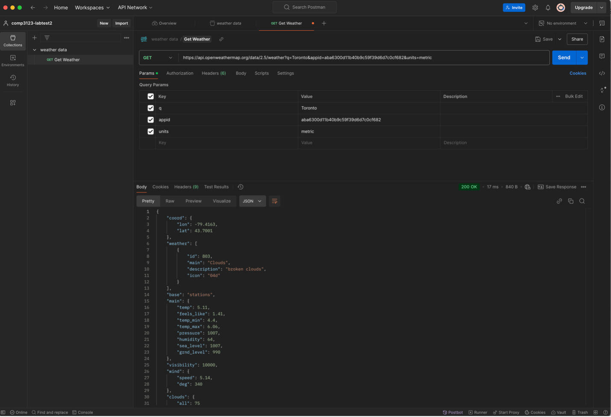
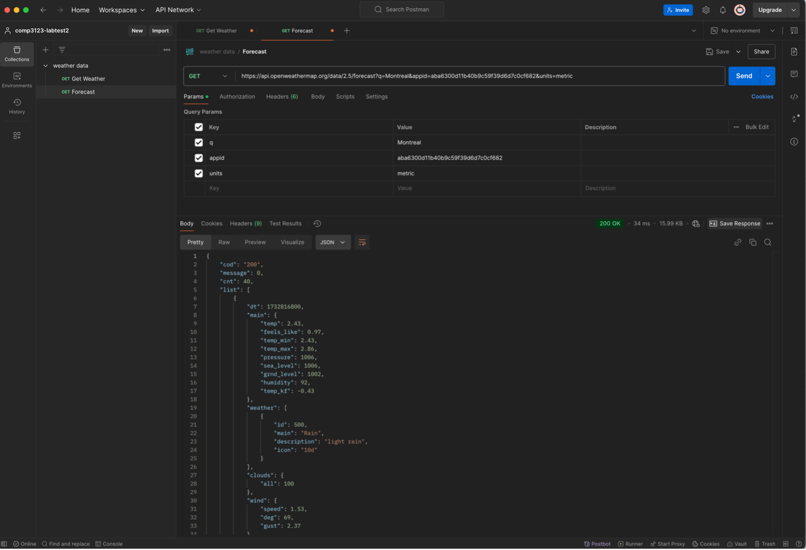

# Weather Forecast App 🌤️

This Weather Forecast App is a simple, user-friendly application that allows users to view the current weather and a 5-day forecast for any city. The app fetches real-time weather data using the [OpenWeather API](https://openweathermap.org/).

---

## Features ✨

- 🌍 **Search by City**: Get real-time weather data for any city in the world.
- 📅 **5-Day Forecast**: Displays daily weather predictions with key metrics like temperature and conditions.
- 📊 **Detailed Weather Data**: Includes humidity, wind speed, air pressure, and temperature details.
- 🖼️ **Dynamic Weather Icons**: Icons update dynamically based on weather conditions.
- 🖥️ **Responsive Design**: Works on all devices, from desktops to smartphones.

---

## Screenshots 📸

### **Home Page**





_Description_: The landing page allows users to search for any city and displays the current weather along with the 5-day forecast.

### **Responsive View**



_Description_: The app adjusts to smaller screen sizes, with stacked containers for weather details and forecasts.

### **Postman Tests**



_Description_: A get request for a city overview.



_Description_: A get request for a city forecast.

---

## Tech Stack 🛠️

- **Frontend**: React.js
- **Styling**: CSS (Flexbox for layout)
- **API**: OpenWeather API for weather data
- **Testing**: Postman for API testing

---

## How to Run Locally 🏃‍♂️

1. **Clone the Repository**:

   ```bash
   git clone https://github.com/your-repo/weather-app.git
   cd weather-app
   ```

2. **Install Dependencies**:

   ```bash
   npm install
   ```

3. **Add API Key**:

   - Create a `.env` file in the root of your project:
     ```
     REACT_APP_OPENWEATHER_API_KEY=your_api_key
     ```
   - Replace `your_api_key` with your OpenWeather API key.

4. **Run the App**:

   ```bash
   npm start
   ```

5. **Open in Browser**:
   - Navigate to `http://localhost:3000` to use the app.

---

## Postman API Tests 🔍

1. **Current Weather Endpoint**:

   - URL: `https://api.openweathermap.org/data/2.5/weather?q={city}&appid={your_api_key}&units=metric`
   - Method: `GET`

2. **Weather Forecast Endpoint**:

   - URL: `https://api.openweathermap.org/data/2.5/forecast?q={city}&appid={your_api_key}&units=metric`
   - Method: `GET`

---

## Challenges & Learning ✍️

- **API Integration**: Learned how to integrate a third-party API (OpenWeather) into a React application.
- **Responsive Design**: Gained experience in creating a responsive layout using CSS flexbox and media queries.
- **Error Handling**: Implemented error handling for failed API requests to improve user experience.

---

## Acknowledgments 💡

- [OpenWeather API](https://openweathermap.org/)
- [React Documentation](https://reactjs.org/docs/getting-started.html)
- [Postman API Testing](https://www.postman.com/)
